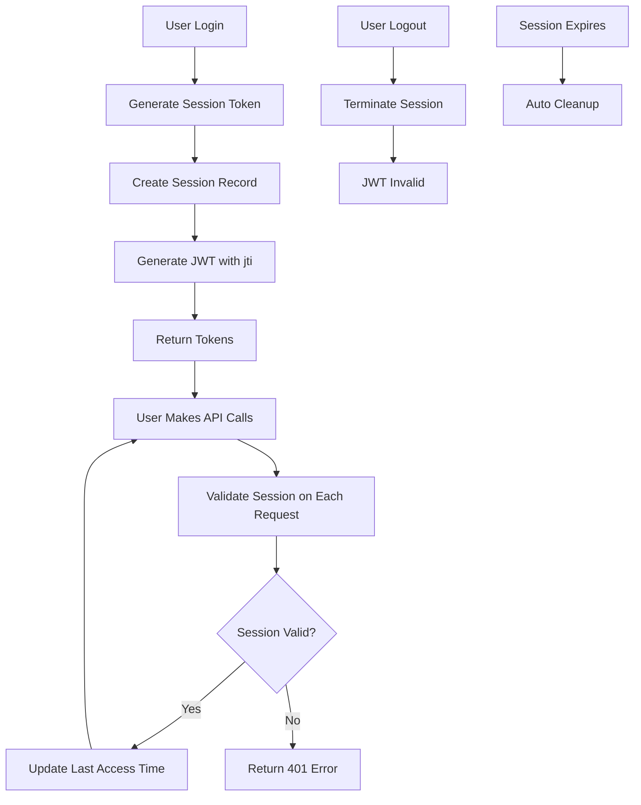

# 🔐 Login & Session Management API

Bu dokümanda halısaha rezervasyon platformunun login sistemi ve multi-device session yönetimi API'leri açıklanmaktadır.

## 📋 İçindekiler
- [Authentication Endpoints](#authentication-endpoints)
- [Session Management](#session-management)
- [Multi-Device Support](#multi-device-support)
- [API Examples](#api-examples)
- [Error Handling](#error-handling)
- [Security Features](#security-features)

## 🚀 Authentication Endpoints

### 1. Kullanıcı Kaydı
```bash
POST /api/v1/auth/register
```

**Request Body:**
```json
{
  "firstName": "Hasan Ali",
  "lastName": "Arıkan",
  "username": "hasanaliarikan077",
  "email": "hasanaliarikan077@gmail.com",
  "password": "test123456",
  "phone": "+905555555555",
  "role": "USER",
  "location": "İstanbul",
  "bio": "Test kullanıcısı"
}
```

**Response:**
```json
{
  "success": true,
  "message": "User registered successfully",
  "data": {
    "user": { ... },
    "accessToken": "eyJhbGciOiJIUzI1NiIs...",
    "refreshToken": "eyJhbGciOiJIUzI1NiIs...",
    "accessTokenExpiresIn": "15m",
    "refreshTokenExpiresIn": "7d",
    "sessionInfo": {
      "sessionId": "cmcg9032v0001qbqmqejxs4yt",
      "deviceInfo": "IOS - Unknown Browser",
      "location": "Local",
      "platform": "IOS"
    }
  }
}
```

### 2. Kullanıcı Girişi
```bash
POST /api/v1/auth/login
```

**Request Headers:**
```
Content-Type: application/json
User-Agent: iPhone 14/iOS 16.0  # Device detection için
```

**Request Body:**
```json
{
  "username": "hasanaliarikan077",
  "password": "test123456"
}
```

**Response:** Register ile aynı format

### 3. Çıkış (Logout)
```bash
POST /api/v1/auth/logout
```

**Request Headers:**
```
Authorization: Bearer <access_token>
```

**Response:**
```json
{
  "success": true,
  "message": "Logout successful",
  "data": {
    "message": "Session terminated successfully"
  }
}
```

## 🎮 Session Management

### 1. Aktif Session'ları Listele
```bash
GET /api/v1/auth/sessions
```

**Response:**
```json
{
  "success": true,
  "message": "User sessions retrieved successfully",
  "data": {
    "sessions": [
      {
        "id": "cmcg9032v0001qbqmqejxs4yt",
        "deviceInfo": "IOS - Unknown Browser",
        "ipAddress": "127.0.0.1",
        "location": "Local",
        "platform": "IOS",
        "lastAccessedAt": "2025-06-28T12:59:47.120Z",
        "createdAt": "2025-06-28T12:59:37.496Z",
        "isCurrent": true
      },
      {
        "id": "cmcg8xbf70003srjzm9551r92",
        "deviceInfo": "ANDROID - Unknown Browser",
        "ipAddress": "127.0.0.1", 
        "location": "Local",
        "platform": "ANDROID",
        "lastAccessedAt": "2025-06-28T12:57:40.749Z",
        "createdAt": "2025-06-28T12:57:28.340Z",
        "isCurrent": false
      }
    ]
  }
}
```

### 2. Belirli Session'ı Sonlandır
```bash
POST /api/v1/auth/sessions/terminate
```

**Request Body:**
```json
{
  "sessionToken": "73b0eec9-529b-4fc5-b2d4-a9c540f3e766"
}
```

### 3. Diğer Session'ları Sonlandır
```bash
POST /api/v1/auth/sessions/terminate-others
```

**Response:**
```json
{
  "success": true,
  "message": "2 other sessions terminated successfully",
  "data": {
    "terminatedCount": 2
  }
}
```

### 4. Tüm Session'ları Sonlandır
```bash
POST /api/v1/auth/sessions/terminate-all
```

## 📱 Multi-Device Support

### Platform Detection
Sistem User-Agent header'ından cihaz tipini otomatik algılar:

- **iOS**: `iPhone 14/iOS 16.0` → `IOS - Unknown Browser`
- **Android**: `Samsung Galaxy S23/Android 13.0` → `ANDROID - Unknown Browser`  
- **Web**: `Mozilla/5.0 (Windows NT 10.0; Win64; x64) AppleWebKit/537.36 Chrome/120.0.0.0` → `WEB - Chrome`

### Session Özellikleri
- ✅ **Multi-device login**: Aynı kullanıcı birden fazla cihazda oturum açabilir
- ✅ **Independent sessions**: Bir cihazdan çıkış diğer cihazları etkilemez
- ✅ **Device tracking**: Her session cihaz bilgisi, IP adresi ve konumla izlenir
- ✅ **Real-time validation**: Her API çağrısında session geçerliliği kontrol edilir
- ✅ **Automatic cleanup**: Süresi dolan session'lar otomatik temizlenir

## 📝 API Examples

### Örnek 1: Multi-Device Login Senaryosu

```bash
# 1. iPhone'dan login
curl -X POST http://localhost:3000/api/v1/auth/login \
  -H "Content-Type: application/json" \
  -H "User-Agent: iPhone 14/iOS 16.0" \
  -d '{"username": "hasanaliarikan077", "password": "test123456"}'

# 2. Android'den login (aynı kullanıcı)
curl -X POST http://localhost:3000/api/v1/auth/login \
  -H "Content-Type: application/json" \
  -H "User-Agent: Samsung Galaxy S23/Android 13.0" \
  -d '{"username": "hasanaliarikan077", "password": "test123456"}'

# 3. Web'den login (aynı kullanıcı)
curl -X POST http://localhost:3000/api/v1/auth/login \
  -H "Content-Type: application/json" \
  -H "User-Agent: Mozilla/5.0 (Windows NT 10.0; Win64; x64) AppleWebKit/537.36 Chrome/120.0.0.0" \
  -d '{"username": "hasanaliarikan077", "password": "test123456"}'

# 4. Session'ları listele
curl -X GET http://localhost:3000/api/v1/auth/sessions \
  -H "Authorization: Bearer <access_token>"

# 5. Diğer cihazları çıkart (sadece current session kalır)
curl -X POST http://localhost:3000/api/v1/auth/sessions/terminate-others \
  -H "Authorization: Bearer <access_token>"
```

### Örnek 2: Session Validation

```bash
# Logout yap
curl -X POST http://localhost:3000/api/v1/auth/logout \
  -H "Authorization: Bearer <access_token>"

# Aynı token ile API çağrısı yap (başarısız olmalı)
curl -X GET http://localhost:3000/api/v1/auth/sessions \
  -H "Authorization: Bearer <same_access_token>"

# Response: {"success": false, "message": "Session is not active, please login again"}
```

## ⚠️ Error Handling

### Authentication Errors
```json
{
  "success": false,
  "message": "Invalid username or password",
  "timestamp": "2025-06-28T12:51:32.513Z",
  "statusCode": 401
}
```

### Session Errors
```json
{
  "success": false,
  "message": "Session is not active, please login again",
  "timestamp": "2025-06-28T12:58:50.541Z"
}
```

### Validation Errors
```json
{
  "success": false,
  "message": "Username and password are required",
  "timestamp": "2025-06-28T12:51:26.403Z",
  "statusCode": 400
}
```

## 🔒 Security Features

### JWT Token Structure
```json
{
  "userId": "cmcg8uct30005nfd7yxh8ipsq",
  "email": "hasanaliarikan077@gmail.com", 
  "role": "USER",
  "jti": "73b0eec9-529b-4fc5-b2d4-a9c540f3e766",  // Session token
  "iat": 1751115577,
  "exp": 1751116477
}
```

### Security Measures
- ✅ **Password hashing**: bcrypt ile 12 rounds
- ✅ **JWT tokens**: Access token (15m) + Refresh token (7d)
- ✅ **Session tracking**: JWT jti claim ile session bağlantısı
- ✅ **Real-time validation**: Her request'te session geçerliliği
- ✅ **IP tracking**: Session bazlı IP adresi takibi
- ✅ **Automatic cleanup**: Expired session'lar otomatik silinir

### Rate Limiting
```javascript
// Global rate limit
general: "100 req/15min per IP"

// Authentication endpoints
auth: "5 req/15min per IP"
```

## 🛠 Environment Variables

```env
# JWT Configuration
JWT_SECRET=your-super-secret-jwt-key
JWT_REFRESH_SECRET=your-super-secret-refresh-key
ACCESS_TOKEN_EXPIRES_IN=15m
REFRESH_TOKEN_EXPIRES_IN=7d

# Database
DATABASE_URL=postgresql://...

# Server
PORT=3000
NODE_ENV=production
```

## 📊 Session Lifecycle



## 🎯 Test Results

### ✅ Başarıyla Test Edilenler:
1. **Multi-device login**: iPhone, Android, Web aynı anda
2. **Session isolation**: Bir cihazdan logout diğerini etkilemiyor
3. **Device detection**: User-Agent'tan otomatik platform algılama
4. **Session termination**: Belirli/diğer/tüm session'ları sonlandırma
5. **Token validation**: Logout sonrası token geçersiz hale geliyor
6. **Real-time tracking**: Last access time güncelleniyor

### 📈 Performance
- Session lookup: O(1) - sessionToken index
- User sessions: O(log n) - userId index
- Cleanup job: Saatte bir çalışır
- Token validation: In-memory JWT verification

---

**Doküman Versiyonu**: 1.0.0  
**Son Güncelleme**: 28 Haziran 2025  
**Test Durumu**: ✅ Tüm testler başarılı 